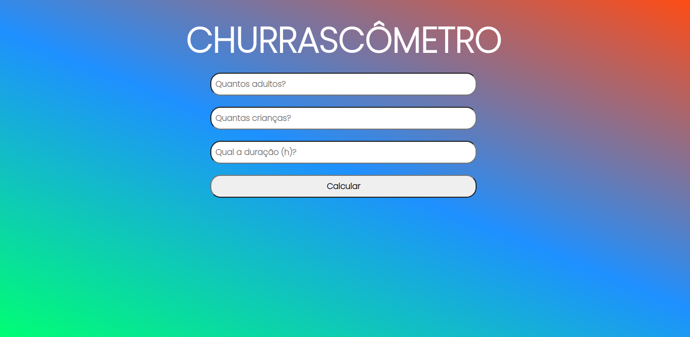
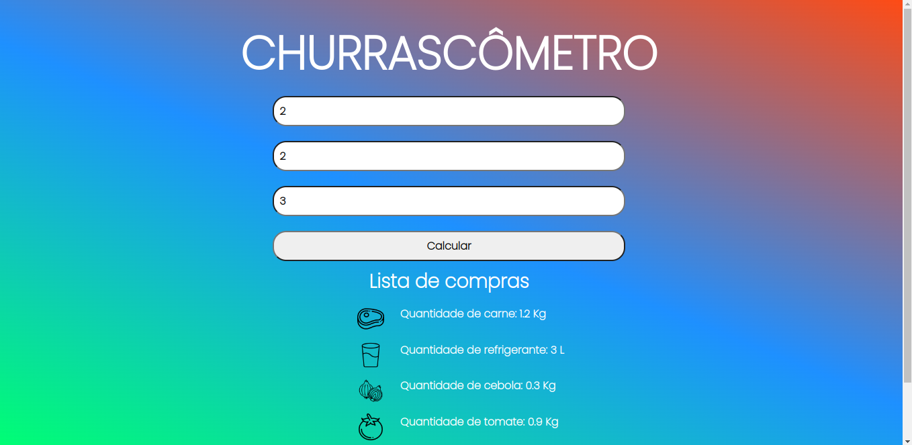

# Progbr-project-churrascometro :pencil:

In this project I can apply my acquired knowledge in HTML, CSS and JavaScript. :heavy_check_mark:
#

## MENU :green_heart:

### 1- RESUME
### 2- PREVIEW
### 3- ABOUT THE COURSE
#

## 1- RESUME

It's a simple project using HTML, CSS and JavaScript.

I used the main HTML tags to assemble the structure of the display page and styled it by changing the positioning, size, fonts and colors of the components through the application of CSS. Already with JavaScript I was able to apply logic functionality to the application.

This whole process was very important to understand in practice how the structure (HTML) of a page works, how the style (CSS) is applied to it and I was able to understand the best way to make a Layout and apply the Box Model concept. Furthermore, I was able to understand how programming logic helps us to create business rules for the benefit of the application.

Improved responsiveness still needs to be implemented.
#

## 2 - PREVIEW

#

## 3 - ABOUT THE COURSE

Full stack web development course provided by Igor Oliveira.

The content includes the following technologies and libraries:

I - FrontEnd:
- HTML5
- CSS3
- JAVASCRIPT
- JQUERY
- BOOTSTRAP
- REACT

II - BackEnd:
- FIREBASE
- NODE JS
- MONGO DB

